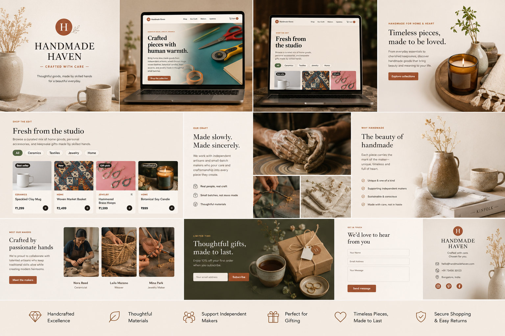
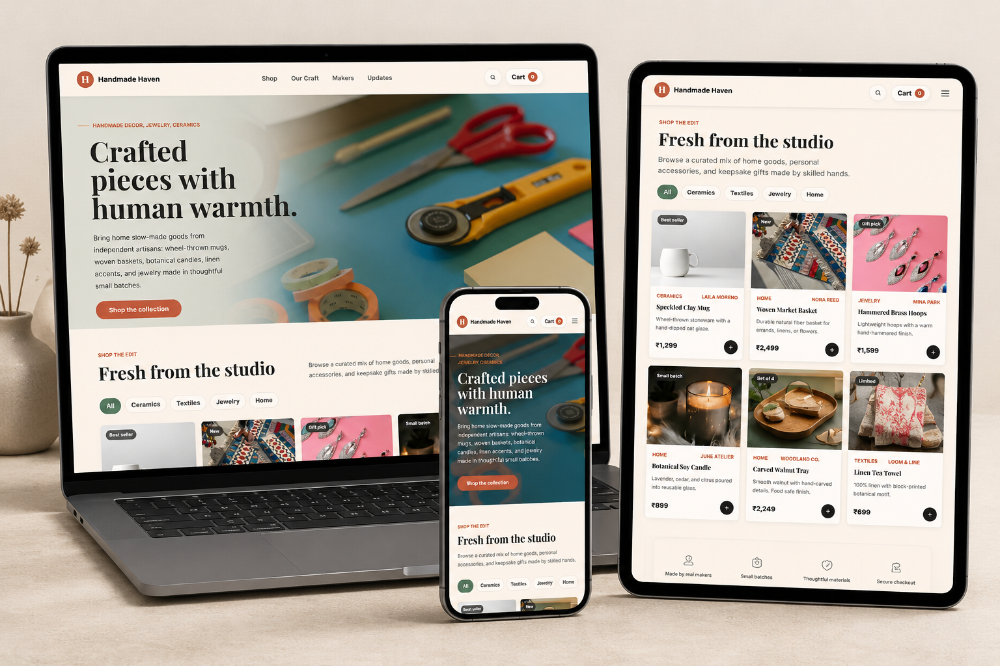
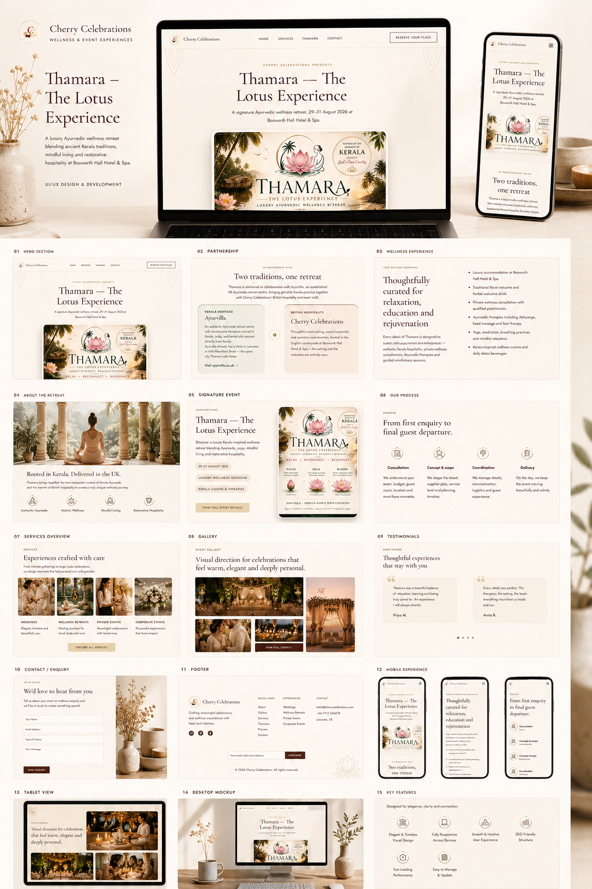
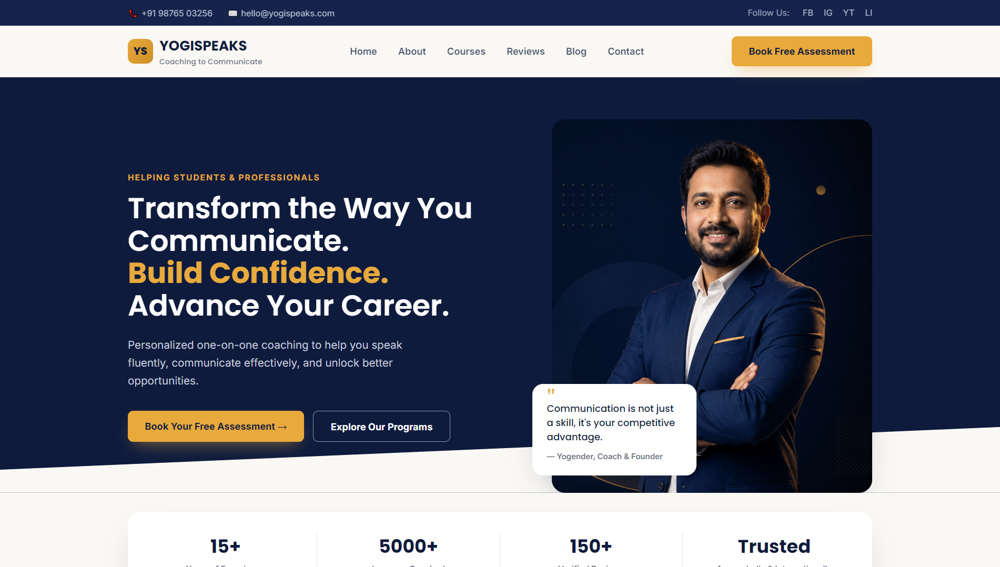
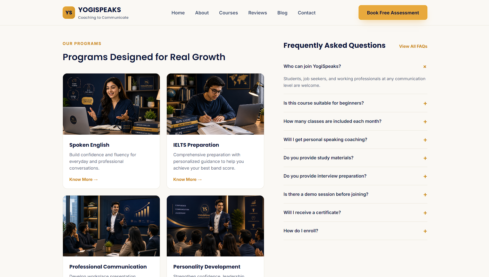
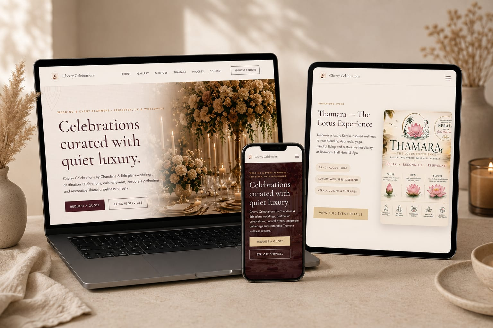

# Kevin Vargese Mathew — Work Samples

A collection of design and web project work, shared for client review.

**GitHub:** [kevin-mathew-cyber](https://github.com/kevin-mathew-cyber)

---

## Gallery

### Handmade Haven — Homepage Design
A full-page e-commerce concept for an artisan goods brand ("Handmade Haven"), covering hero section, product grid, brand story, maker spotlights, and a newsletter/contact block — all in a warm, craft-led visual style.

### Handmade Haven — Responsive Mockup
The same site shown across desktop, tablet, and mobile breakpoints, demonstrating the responsive layout and how the shop grid and navigation adapt across devices.

### Project 3
*(brand, purpose, and what you designed.)*

### YogiSpeaks — Coaching Website Hero
Landing page hero for "YogiSpeaks," a communication-coaching business — headline messaging, founder photo, and a strong call-to-action for booking a free assessment.

### Project 5
*(brand, purpose, and what you designed.)*

### Cherry Celebrations — Event Planning Site
Website mockup for "Cherry Celebrations," a wedding and event planning brand, including their signature "Thamara" luxury wellness retreat offering — shown across laptop and tablet.

---

## Contact

Feel free to reach out if you'd like to discuss any of these projects further.
